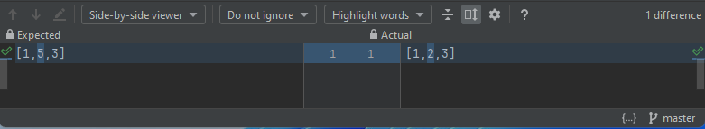
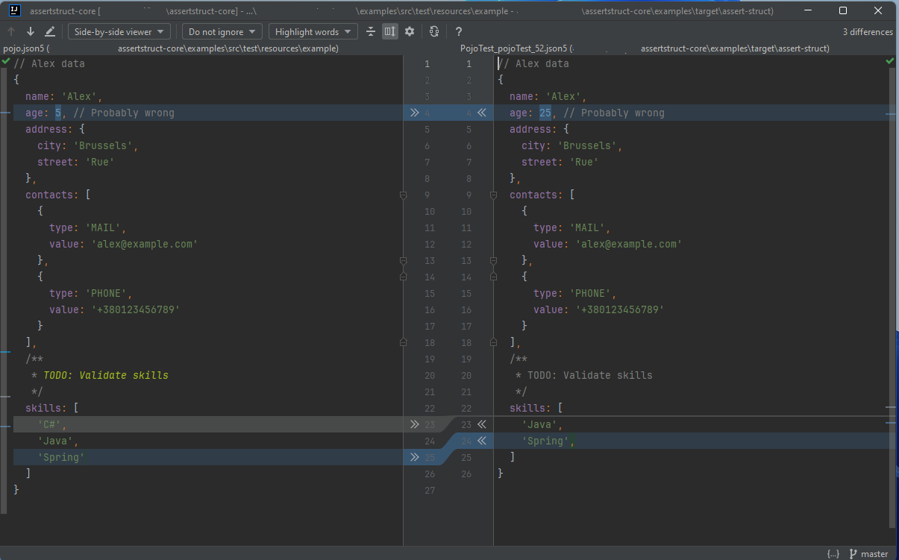

AssertStruct [](https://www.apache.org/licenses/LICENSE-2.0.txt)
========
AssertStruct is a library for validating complex data structures including hierarchy of POJO objects. 
It allows you to present a data structure as a simplified JSON-like data tree and compare it with a template. 
In case of failure, the difference will be transformed into a simple text presentation that can be edited and analyzed using any text diff tool.

## Table of contents
- [AssertStruct in 30 sec](#AssertStruct-in-30-sec)
- [Motivation](#Motivation)
- [Usage](#Usage)
- [Template format](#template-format)
- [Requirements](#Requirements)
- [Configuration and customization](#Configuration-and-customization)
- [License](#license)
- [Status](#Status)

# AssertStruct in 30 sec
```java
import static ua.kiev.its.assertstruct.AssertStruct.assertStruct;

public class PojoTest {
    @Test
    public void inlineTemplateTest() {
        assertStruct("[1,5,3]", new int[]{1,2,3});
    }

    @Test
    public void resourceTemplateTest() {
        assertStruct("./example/pojo.json5", POJO);
    }
}
```
In IDEA first test will generate next failure report:
```
org.opentest4j.AssertionFailedError: Actual object doesn't match provided template,
Diff: diff:///[C:\Boris\PRJ\pet\assertstruct-core\examples\src\test\java\PojoTest.java:38]?/[C:\Boris\PRJ\pet\assertstruct-core\examples\target\assert-struct\PojoTest_inlineTest_38.json5:0]&
Actual value: file://C:\Boris\PRJ\pet\assertstruct-core\examples\target\assert-struct\PojoTest_inlineTest_38.value.json5
expected: [1,5,3] but was: [1,2,3]
Expected :[1,5,3]
Actual   :[1,2,3]
<Click to see difference>
```
And when you will click to see difference you will get:<br>


For more complex objects it's even more fascinating. In combination with *Console File Caddy* 
Diff row will be transformed to a link which open diff editor for pojo.json5 file.



# Motivation
There are many great libraries to validate complex Java objects. However, they are often missing 2 points: 
1. You need to write significant amount of code to validate all required parts of data. This code can be difficult to write and understand.
Also, because of complexity, developers tends to check only some parts of resulting structure. Which can lead to missed errors and edge cases.  
2. You must not only write your test, but also maintained them. In 80% of cases when test failed (or mistakenly not failed), 
it's not actually a bug in code, but wrong test which you must modify because of requirement changes or missed earlier cases.
And in typical scenario to fix test you will need to read and decrypt a bunch of java code and then write even more code to cover required scenario.

In perfect world test code must be:
1. Simple and easy to write.
2. Simple and easy to modify.
3. Document desirable functionally.

This library must be and answer to that issues.
1. Mostly no java code to validate even complex data structure. Usually you will use one function assertStruct 
2. Simple human-readable format for templates. Usually your template will be serialized version of your actual value.
You even don't need to write this template, simply copy and modify answer of first test run.
3. Template format support comments. So you can add some explanations to your test
4. If test fail diff tool will preserve all comments and masked fields. So you will clearly see the failed part.  
5. Extended navigation support. Library automatically discover do you use inline or external file for template and build correct navigation link to your template.
For pre Java15 or complex templated external file will be a better choice, however with a new text block feature inline templates can become very handy.

#### I bit more complex example
```json5
// response of API request /books
{
    generatedAt: '$NOW', // Result must be not cached, so it was generated now +/- few seconds
    /* count property contains actual size of returned list because all items were returned */
    count: '$.items.size()', 
    items: [
        {
            id: '$/[0-9a-fA-F]{8}-[0-9a-fA-F]{4}-[0-9a-fA-F]{4}-[0-9a-fA-F]{4}-[0-9a-fA-F]{12}/', // UUID
            createdAt: '$ANY_DATE', // We are storing date without time when book was registered 
            updatedAt: '$ANY_DATETIME', // Date and time when record was last updated 
            title: '$* ::String',
            author: {
                id: '$/[0-9a-fA-F]{8}-[0-9a-fA-F]{4}-[0-9a-fA-F]{4}-[0-9a-fA-F]{4}-[0-9a-fA-F]{12}/', // UUID
                name: '$* ::String',
                surname: '$* ::String'
            },
            pages: '$* ::Integer',
            '$#createdAt.equals(updatedAt)': false // use SpEL to check that created and updated dates are not equal 
        },
        '$...' // rest of items
    ],
    full: true // true if all items were returned
}
```


# Usage
Maven
```xml
        <dependency>
            <groupId>ua.kiev.its.assertstruct</groupId>
            <artifactId>assertstruct-core</artifactId>
            <version>1.0</version>
            <scope>test</scope>
        </dependency>
```
Usually you will use default configuration of AssertStruct and static method imported from AssertStructUtils.
```java
import static ua.kiev.its.assertstruct.AssertStruct.assertStruct;
...
    @Test
    public void inlineTemplateTest() {
        assertStruct("[1,5,3]", new int[]{1,2,3});
    }
```
AssertStruct use smart detection of file name in expected parameter.
However, you can use ua.kiev.its.assertstruct.Res class to define template resource.
This resource can be reused for multiple asserts or even used as simple data loader
```java
    Res POJO = Res.from("example/pojo.json5");
    Res INLINE = Res.of("[1,2,3]");
    Res AUTO_DETECT = Res.of("{key: 'value'}");

    @Test
    public void assertTest() {
        assertStruct(INLINE, new int[]{1, 2, 3});
    }

    @Test
    public void asStringTest() {
        String templateAsString = AUTO_DETECT.asString();
        assertEquals(templateAsString, "{key: 'value'}");
    }

    @Test
    public void asDataTest() {
        Map data = (Map) AUTO_DETECT.asTemplate().toData();
        assertEquals(data.get("key"), "value");
    }
```
#### TODO Custom config  
If shared, default configuration does not work for you, it is possible to create custom configuration of AssertStruct service class
```java
// TODO
```

# Template format
[JSON5](https://json5.org/) file format used to define templates.
Current implementation relies on Jackson parser with toggle on next features 
```
ALLOW_UNQUOTED_FIELD_NAMES
ALLOW_UNESCAPED_CONTROL_CHARS
ALLOW_TRAILING_COMMA
ALLOW_SINGLE_QUOTES
ALLOW_BACKSLASH_ESCAPING_ANY_CHARACTER
ALLOW_NON_NUMERIC_NUMBERS
ALLOW_JAVA_COMMENTS
ALLOW_LEADING_DECIMAL_POINT_FOR_NUMBERS
ALLOW_TRAILING_DECIMAL_POINT_FOR_NUMBERS
ALLOW_LEADING_PLUS_SIGN_FOR_NUMBERS
```
This is not 100% compatible to JSON5, but close enough.
*I'm thinking about implementing even more loose parser, to allow non-quoted strings and "keys" for arrays, but it will be less supported from IDE.*  

Usually template will contain json serialized version of expected value. Matcher will iterate by properties and elements of objects and arrays and compare by equals.
Some keys or values can be represented not by actual value but by some pattern.
For example:
```json5
{ a: '$*' }
```
This template represent dictionary with single key ```"a"``` and with any value.

#### Single and double quotes.
In many cases JSON5 format require quotes and you can use single or double. 
However, in **double-quoted** strings **all patterns will be ignored**.
Because single quote is simpler to use in Java strings, it is recommended to use single quote where possible. 
#### Comments 
JSON5 format allow single and multiline comments. Library try to detect which comment applied to which field and will try to preserve it's position.
```json5
{
  a: 1, // This is comment for field 'a'
  /**
  * This is multiline comment for field 'b'
  */
  b: 2
}
```
#### Formatting
Library will try to preserve trailing commas, indents and line breaks.
However, in some cases when new fields are added or changes of order change formating will fall back to default configuration

#### Object | Map | Dict
By default, properties are unordered and no additional properties allowed. 
In case of failure template properties order will be preserved. Additional properties will be added in place where they will be found during object traversal  
However this can be changed by inline configuration
```json5
{
  '$conf': {
    ignoreUnknown: true,
    ordered: true
  }
}
```
or in shorter form 
```json5
{
  '$opt.ignoreUnknown': true,
  '$opt.ordered': true,
}
```
There 2 types patterns in keys are supported:
* Matchers - will select one or multiple keys from actual value dictionary. For example regular expression
* Evaluator ???? - will calculate a new value and then will try to match this value to corespondent value in template. For example size, or length methods.    
#### Arrays | Lists 
By default, elements of array are ordered and each element of array must be matched to corespondent element in template.
This can be changed by inline configuration, because keys are not allowed in array eac configuration must be presented as special string element in array.
```json5
[
  '$opt.ordered: true',
]
```
To support arrays of unknown size it is possible to add special values matcher as array element **'$...'** 
For example:
```json5
[1,2,'$...']
```
means array which is started from '1' and '2' and then contains zero ore more '2' elements
### Type check
It is possible to add type validation to any value matcher. 
In format *'<pattern> ::FullQualifiedClassName'* or in short form *'<pattern> ::className'*
if it is only class name, then class will be searched in configured list of packages. By default, java.lang and java.util.
For example:
```json5
'$* ::Number'
```
means any value assignable to java.lang.Number 

### Matchers

| Pattern            | Description           | Note                                                                            | Key | Impl |
|--------------------|-----------------------|---------------------------------------------------------------------------------|-----|------| 
| $*                 | Any value             | Includes all types, Maps, Lists, null, etc.                                     | [x] |      |
| ${*}               | Any Object            | Includes Maps, Objects, etc.                                                    |     |      |
| $[*]               | Any List              | Include collections and arrays                                                  |     |      |
| $NOW               | Current date          | Compare with current date with default precision (1 min)                        |     | -    |
| $NOW(n)            | Current date          | Compare with current date with precision of n second                            |     | -    |
| $ANY_DATE          | Any date              | Value can be parsed as date with time using default format                      |     |      |
| $ANY_DATETIME      | Any date time         | Value can be parsed as date using default format                                |     |      |
| $ANY_TIME          | Any time              | Value can be parsed as time using default format                                |     |      |
| $DATE(xxx)         | Any time              | Value can be parsed as date or time using format 'xxx'                          |     | -    |
| $/regexp/          | Regexp                | Value matched by regular expression                                             | [x] |      |
| $.name1.method1()  | Simple evaluator      | Calculate value of field, property or no-arg method                             | [x] | -    |
| #expresion         | Calculate expression  | Calculate complex expression using external library. By default SpEL. optional  | [x] |      |
|                    |                       |                                                                                 |     |      |

# Requirements
* Java 8+.
* Jackson Core 2.14+.
* Jackson DataBinding. Optional, used as default POJO -> JSON converter. If no JSONConverter present Objects will be converted using toString 
* Spring Core. Optional, used to calculate complex expression. If not present *#expresion* will throw exceptions  

# Configuration and customization

**// TODO**

# Status
The project is under active development. However, implemented part is already working and I inspire anyone to try it.
Any feedback is welcome. 
I'm planning to make first release in a few weeks, so if you are considering to use it in production, please go ahead.

License
-------
AssertStruct is licensed under [Apache 2.0 licence](https://www.apache.org/licenses/LICENSE-2.0).

Release notes
=============